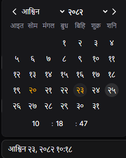
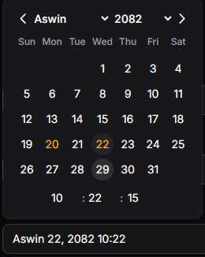
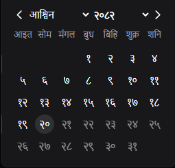
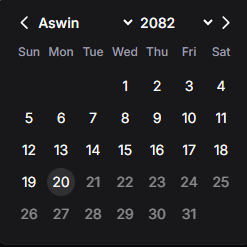
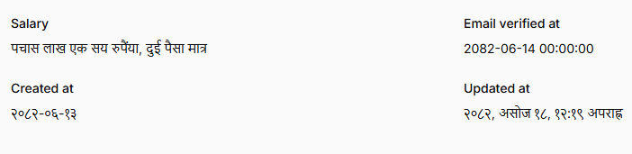
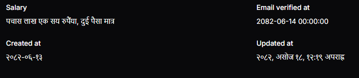

# 📅 Filament Nepali Date Time Support

[](https://packagist.org/packages/rohanadhikari/filament-nepali-datetime)
[](https://github.com/rohanadhikari/filament-nepali-datetime/actions?query=workflow%3Arun-tests+branch%3Amain)
[](https://github.com/rohanadhikari/filament-nepali-datetime/actions?query=workflow%3A"Fix+PHP+code+styling"+branch%3Amain)
[](https://packagist.org/packages/rohanadhikari/filament-nepali-datetime)

A FilamentPHP plugin that adds support for Nepali Date (Bikram Sambat - BS) in Filament’s form, infolist and table components.

## Installation

You can install the package via composer:

```bash
composer require rohanadhikari/filament-nepali-datetime
```

---

## Screenshots

### Nepali DateTime Picker in Form




### Nepali Date Picker in Form




### Nepali Functions




---

## Usage

### 1. NepaliDateTimePicker

It extends Filament [DateTimePicker](https://filamentphp.com/docs/4.x/forms/date-time-picker) to support **Nepali Date (BS)**.

```php
use RohanAdhikari\FilamentNepaliDatetime\NepaliDatetimePicker;
use RohanAdhikari\FilamentNepaliDatetime\NepaliDatePicker;

NepaliDatetimePicker::make('dob')
    ->weekStartsOnSaturday()
    ->dehydrateStateToNepali()
    ->locale('np')
    ->maxDate(NepaliDate::now())
    ->minDate(now()->subYear(20)), // Suport NepaliDate/ Carbon / Nepalidate string (only support format Y-m-d)

    //or for date only
NepaliDatePicker::make('dob')
    ->format('d-m-Y')
    ->locale('np')
    ->maxDate(NepaliDate::now()),

```

<!-- #### Available Nepali Methods -->

---

### 2. Nepali Functions

The following functions are available on TextColumn and/or TextEntry.

#### `nepaliDate()`

Format a stored BS date into English or Nepali locale. This function can be used in TextColumn and Text Entry both.

⚠️ **Note:** This does **not** convert AD → BS.
If you want conversion, use [`toNepaliDate()`](#tonepalidate).

```php
TextColumn::make('dob')
    ->nepaliDate(
        stateFormat: 'Y-m-d',
        format: 'M d, Y',
        locale: 'np'
    );
    //or
TextEntry::make('dob')
    ->nepaliDate(
        stateFormat: 'Y-m-d',
        format: 'd M, Y',
        locale: 'en'
    );
```

| Argument      | Type                        | Default        | Description            |
| ------------- | --------------------------- | -------------- | ---------------------- |
| `stateFormat` | `string \| Closure \| null` | `null`         | Format of stored date. |
| `format`      | `string \| Closure \| null` | default format | Output format (BS).    |
| `locale`      | `string ('en' or 'np')`     | `'en'`         | Locale to format date. |

#### `toNepaliDate()`

Converts a stored AD date into BS date, then formats it. This function can be used in TextColumn and Text Entry both.

```php
// Table Column
TextColumn::make('dob')
    ->toNepaliDate(format: 'd M, Y', locale: 'np');
// Infolist Text Entry
TextEntry::make('dob')
    ->toNepaliDate(format: 'd M, Y', locale: 'en');
```

| Argument   | Type                        | Default               | Description                              |
| ---------- | --------------------------- | --------------------- | ---------------------------------------- |
| `format`   | `string \| Closure \| null` | default (from config) | Output format for BS date.               |
| `locale`   | `string ('en' or 'np')`     | `'en'`                | Display language for formatted date.     |
| `timezone` | `string \| Closure \| null` | `null`                | Timezone for parsing the stored AD date. |

#### `nepaliNumber()`

Convert numbers into Nepali numerals or currency format.. This function can be used in TextEntry.

```php
TextEntry::make('salary')
    ->nepaliNumber(currencySymbol: true, locale: 'np');
```

| Argument         | Type                 | Default | Description                                                 |
| ---------------- | -------------------- | ------- | ----------------------------------------------------------- |
| `currencySymbol` | `string \| bool`     | `false` | Whether to display with currency symbol or symbol to dislay |
| `only`           | `bool`               | `false` | If true, Show Only at the end.                              |
| `locale`         | `string ('en'/'np')` | `'en'`  | Display locale.                                             |
| `format`         | `bool`               | `true`  | Whether to apply number formatting (commas, etc).           |

#### `nepaliWord()`

This function used to convert numbers into Nepali Words optionally, currency words also. This function can be used in TextEntry.

```php
TextEntry::make('amount')
    ->nepaliWord(locale: 'en');
```

| Argument   | Type           | Default | Description                                        |
| ---------- | -------------- | ------- | -------------------------------------------------- |
| `currency` | `bool`         | `false` | Whether to convert the number into currency words. |
| `only`     | `bool`         | `false` | If true, Show Only at the end.                     |
| `locale`   | `'en' \| 'np'` | `'en'`  | Language of the output (English or Nepali).        |

---

## Changelog

Please see [CHANGELOG](CHANGELOG.md) for more information on what has changed recently.

## Contributing

Please see [CONTRIBUTING](.github/CONTRIBUTING.md) for details.

## Security Vulnerabilities

Please review [our security policy](../../security/policy) on how to report security vulnerabilities.

## Credits

-   [Rohan Adhikari](https://github.com/rohanAdhikari1)
<!-- -   [All Contributors](../../contributors) -->

## License

The MIT License (MIT). Please see [License File](LICENSE.md) for more information.
