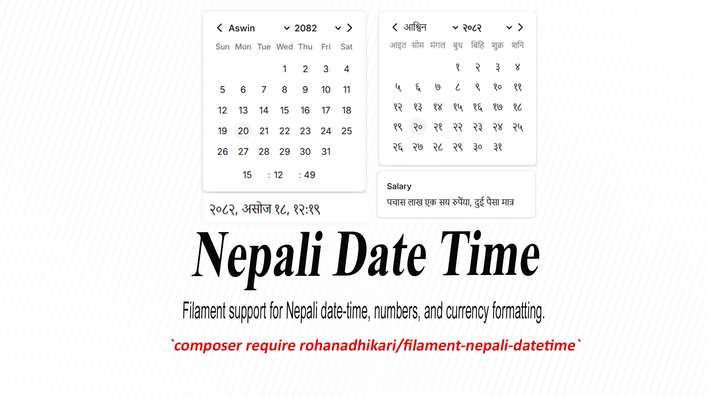

# 📅 Filament Nepali Date Time Support

[](https://packagist.org/packages/rohanadhikari/filament-nepali-datetime)
[](https://filamentphp.com/)
[](https://packagist.org/packages/rohanadhikari/filament-nepali-datetime)

A FilamentPHP plugin that adds support for Nepali Date (Bikram Sambat - BS) in Filament’s form, infolist and table components.


## Installation

You can install the package via composer:

```bash
composer require rohanadhikari/filament-nepali-datetime
```

---

## Screenshots

### Nepali DateTime Picker in Form


### Nepali Date Picker in Form


### Nepali Functions


---

## Usage

To use `NepaliDate`, please refer to the documentation of [`NepaliDate`](https://github.com/rohanAdhikari1/NepalIDatePHP).

### 1. NepaliDateTimePicker

> [!WARNING]  
> If you are using `timestamp` and `datetime` column type consider using [`ADAsNepaliDate`](https://github.com/rohanAdhikari1/NepalIDatePHP/blob/main/docs/LARAVEL.md#cast-attribute-to-nepalidate) cast in model.

It extends Filament [DateTimePicker](https://filamentphp.com/docs/4.x/forms/date-time-picker) to support **Nepali Date (BS)**.

```php
use RohanAdhikari\FilamentNepaliDatetime\NepaliDatetimePicker;
use RohanAdhikari\FilamentNepaliDatetime\NepaliDatePicker;

NepaliDatetimePicker::make('dob')
    ->weekStartsOnSaturday()
    ->dehydrateStateInNepali()
    ->locale(NepaliDate::NEPALI)
    ->maxDate(NepaliDate::now())
    ->minDate(now()->subYear(20)), // Suport NepaliDate/ Carbon / Nepalidate string

    //or for date only
NepaliDatePicker::make('dob')
    ->format('d-m-Y')
    ->locale(NepaliDate::NEPALI)
    ->maxDate(NepaliDate::now()),

```

### Configuring the locale

The picker supports two locales:

-   `'en'` – English
-   `'np'` – Nepali

```php
NepaliDatetimePicker::make('dob')
    ->locale(NepaliDate::NEPALI);
```

### Configuring the first day of the week

Similar to [Filament Datetime Picker](https://filamentphp.com/docs/4.x/forms/date-time-picker#configuring-the-first-day-of-the-week). New convenient helper method is added.

```php
NepaliDatePicker::make('dob')
    ->weekStartsOnSaturday()
```

### Saving Date in Nepali Format

By Default, Datetime is saved in english format even locale is 'np'. You can configure it to save in **Nepali Unicode** in the database.

> [!WARNING]  
> In Laravel migrations, **don’t use** `timestamp` for Nepali dates. Instead, use `string`, because `timestamp` and `datetime` cannot store Unicode characters.

```php
NepaliDatetimePicker::make('dob')
    ->dehydrateStateInNepali()
```

---

### Methods Supporting NepaliDate

These methods support **NepaliDate**, **Carbon**, or **NepaliDate string**:

| Method                 | Description                                                  | Example Usage                                          |
| ---------------------- | ------------------------------------------------------------ | ------------------------------------------------------ |
| `defaultFocusedDate()` | Sets the default date when the picker opens                  | `->defaultFocusedDate(NepaliDate::now())`              |
| `disabledDates()`      | Disables specific dates (array of Carbon/NepaliDate/strings) | `->disabledDates([NepaliDate::now(),now()->addDay()])` |
| `maxDate()`            | Sets the maximum selectable date                             | `->maxDate(NepaliDate::now())`                         |
| `minDate()`            | Sets the minimum selectable date                             | `->minDate(now()->subYear(20))`                        |

---

### DatePicker Key Bindings

The DatePicker supports keyboard navigation for accessibility and ease of use.

#### Navigation

-   **Arrow Left** → Move focus to the previous day
-   **Arrow Right** → Move focus to the next day
-   **Arrow Up** → Move focus to the same week day in the previous week
-   **Arrow Down** → Move focus to the same week day in the next week

#### Month / Year Shortcuts

-   **Alt + Arrow Left** → Focus the previous month
-   **Alt + Arrow Right** → Focus the next month
-   **Alt + Arrow Up** → Focus the previous year
-   **Alt + Arrow Down** → Focus the next year

#### Page Navigation

-   **Page Up** → Previous month
-   **Page Down** → Next month
-   **Shift + Page Up** → Previous year
-   **Shift + Page Down** → Next year

#### Week Navigation

-   **Home** → Jump to the start of the week
-   **End** → Jump to the end of the week

#### Selection & Clearing

-   **Enter** → Select the currently focused day
-   **Backspace / Delete / Clear** → Clear the selected date

---

### 2. Nepali Functions

The following functions are available on TextColumn and/or TextEntry.

#### `nepaliDate()`

Format a stored BS date into English or Nepali locale. This function can be used in TextColumn and Text Entry both.

> [!NOTE]  
> This does **not** convert AD → BS.
> If you want conversion, use [`toNepaliDate()`](#tonepalidate).

```php
TextColumn::make('dob')
    ->nepaliDate(
        stateFormat: 'Y-m-d',
        format: 'M d, Y',
        locale: 'np'
    );
    //or
TextEntry::make('dob')
    ->nepaliDate(
        stateFormat: 'Y-m-d',
        format: 'd M, Y',
        locale: 'en'
    );
```

| Argument      | Type                        | Default        | Description            |
| ------------- | --------------------------- | -------------- | ---------------------- |
| `stateFormat` | `string \| Closure \| null` | `null`         | Format of stored date. |
| `format`      | `string \| Closure \| null` | default format | Output format (BS).    |
| `locale`      | `string ('en' or 'np')`     | `'en'`         | Locale to format date. |

#### `toNepaliDate()`

Converts a stored AD date into BS date, then formats it. This function can be used in TextColumn and Text Entry both.

```php
// Table Column
TextColumn::make('dob')
    ->toNepaliDate(format: 'd M, Y', locale: 'np');
// Infolist Text Entry
TextEntry::make('dob')
    ->toNepaliDate(format: 'd M, Y', locale: 'en');
```

| Argument   | Type                        | Default               | Description                              |
| ---------- | --------------------------- | --------------------- | ---------------------------------------- |
| `format`   | `string \| Closure \| null` | default (from config) | Output format for BS date.               |
| `locale`   | `string ('en' or 'np')`     | `'en'`                | Display language for formatted date.     |
| `timezone` | `string \| Closure \| null` | `null`                | Timezone for parsing the stored AD date. |

#### `nepaliNumber()`

Convert numbers into Nepali numerals or currency format.. This function can be used in TextEntry.

```php
TextEntry::make('salary')
    ->nepaliNumber(currencySymbol: true, locale: 'np');
```

| Argument         | Type                 | Default | Description                                                 |
| ---------------- | -------------------- | ------- | ----------------------------------------------------------- |
| `currencySymbol` | `string \| bool`     | `false` | Whether to display with currency symbol or symbol to dislay |
| `only`           | `bool`               | `false` | If true, Show Only at the end.                              |
| `locale`         | `string ('en'/'np')` | `'en'`  | Display locale.                                             |
| `format`         | `bool`               | `true`  | Whether to apply number formatting (commas, etc).           |

#### `nepaliWord()`

This function used to convert numbers into Nepali Words optionally, currency words also. This function can be used in TextEntry.

```php
TextEntry::make('amount')
    ->nepaliWord(locale: 'en');
```

| Argument   | Type           | Default | Description                                        |
| ---------- | -------------- | ------- | -------------------------------------------------- |
| `currency` | `bool`         | `false` | Whether to convert the number into currency words. |
| `only`     | `bool`         | `false` | If true, Show Only at the end.                     |
| `locale`   | `'en' \| 'np'` | `'en'`  | Language of the output (English or Nepali).        |

---

## Changelog

Please see [CHANGELOG](CHANGELOG.md) for more information on what has changed recently.

## Contributing

Please see [CONTRIBUTING](.github/CONTRIBUTING.md) for details.

## Security Vulnerabilities

Please review [our security policy](../../security/policy) on how to report security vulnerabilities.

## Credits

-   [Rohan Adhikari](https://github.com/rohanAdhikari1)
<!-- -   [All Contributors](../../contributors) -->

## License

The MIT License (MIT). Please see [License File](LICENSE.md) for more information.
